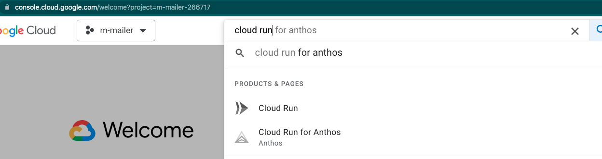

# Shiny App Deployed on Google Cloud using Docker

This project contains the following main files:

 ### Dockerfile
 This dockerfile configures to use the docker image from this URL:https://hub.docker.com/r/rocker/shiny-verse
 And then loads all the necessary libraries including shiny dashboard and server

 The image is configured to expose port 8080 to which the shiny-server is connected

 ### shiny-server.conf

Shiny Server is an open source software to host your Shiny applications. All the configuration related information for Shiny server is added in shiny-server.conf file. For e.g.;

* site_dir configuration specifies the directory that contains Shiny applications and other web assets (HTML files, CSS files, etc.)
You place Shiny applications inside this directory to be invoked by the user. For instance, a Shiny application stored in 
`/srv/shiny-server/myApp` would be available at http://localhost:8080/myApp 
You could also place HTML files in this directory to make them available on your server, as well.

### shiny-server.sh
This shell executable file is used by the docker to create the necessary directories, set permissions and then finally start the shiny server

### app.R

This is the main Shiny app. 

## Building the docker image
Docker is a tool that is used to automate the deployment of applications in `containers` so that applications can work seamlessly in different operating systems and environments with no changes to the application.

While you can install Docker on your computer and follow the steps below, it is easier to use Google Cloud Shell to get started with these steps without any installation as everything that is needed are already installed here. 

Here are the steps:

### Create a project

On Google Cloud, everything begins with creating a project;
navigate to https://console.cloud.google.com/ and first create a project as shown below

Give some name to your project 

### Activate Cloud Shell

GCP provides a free computing environment that we can use to build, test etc.. This is called Google Cloud Shell. 

To access this computing platform, from the console page, click on 'Activate Cloud Shell' button on the top right

This will open a terminal in the bottom pane

### Clone the shiny project

From the cloud shell terminal clone this project with the below command

`git clone https://github.com/jravi123/shiny-app.git`

Alternatives: You can also clone with other alternatives as shown on github

Once cloned, navigate into the root of this folder and run the below command:

* `cd ~` - optional step if you are not already in the home folder. This command will take you to your home folder
* `cd shiny-app` - if you are in the homefolder, you can now navigate to the root of shiny application with this command - assumes you cloned the shiny application in your home folder
* `docker build -t mydashboard .` - this command will build your docker image with the name mydashboard
* `docker run -d -p 8080:8080 mydashboard` - start the shiny app with this command

## Deploying to Google Cloud using Cloud Run

You can deploy your Docker application on GCP to make it accessible to anyone on the Internet using Google Cloud Run. You can setup a continuous deployment (CD) on your project on GitHub so that as soon as changes are pushed to your GitHub repository it will be deployed again to the external URL.

Here is how to do it; key in 'Cloud Run' in your cloud console (https://console.cloud.google.com/)search bar and select Cloud Run from the drop down

You can also reach this using the left navigation bar of your cloud console page.

Select 'Create Service' and set the below configurations and select 'Create' button towards the end to create a Cloud Run service.

This step will retrieve your code from GitHub and deploy to on GCP and will provide an external facing URL like below

https://shiny-app-z2dwtb4qlq-uc.a.run.app/

